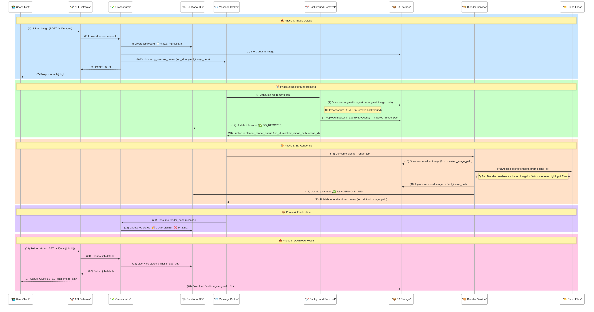
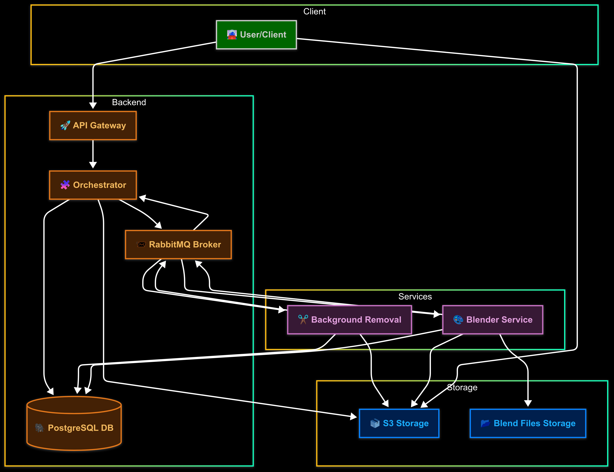

# LUMIX - Service for Automatic Background Removal of Used Car Images

## Project Overview

This project aims to develop a REST service for automatic background removal of used car images, enabling their seamless integration into virtual environments such as showrooms.

### Problem

In the used car sales industry, presenting vehicles in a professional and appealing manner is essential. However, the manual process of:

- Removing backgrounds (background removal)
- Handling semi-transparent areas (windows, lights, reflections)
- Realistic integration with new backgrounds

is slow, costly, and error-prone. Automating this process would:

- Reduce processing times
- Ensure consistent and professional results
- Support large volumes of images

### Description

The project involves developing a Spring Boot REST service that:

- Performs automatic background removal on car images
- Detects and manages semi-transparent areas to preserve realism
- Places the car on a new background with correct lighting and perspective
- Ensures scalability and reliability through:
    - Spring Cloud (load balancing, fault tolerance) or
    - Kubernetes (containerization, autoscaling)

### Technical Notes

**Image processing:**
- OpenCV
- Pillow/Scikit-Image (Python, for post-processing)
- Deep Learning (pre-trained segmentation models, e.g., U-Net)
- REMBG: [https://github.com/danielgatis/rembg](https://github.com/danielgatis/rembg)

## Architecture Diagram

### 🧭 1. Animated Architecture Flow – Rendering Pipeline

> A dynamic and interactive diagram showing how the rendering flow works across services.

[🔗 View Animated Diagram (HTML)](docs/animated-flow.html)

---

### 🧱 2. Detailed Static Flow – Technical Components

> A high-level overview of the services and technologies involved in the system architecture.

---

### 🌱 3. Simple Static Flow – Conceptual View

> A minimal and easy-to-understand flow for introducing the system to non-technical stakeholders.

### Activities

1. **Problem analysis and study of existing solutions**
    - Evaluation of background removal tools
    - Definition of requirements

2. **Architecture design**
    - Choice between Spring Cloud or Kubernetes for reliability
    - REST API design (upload, processing, download)
    - Data model for tracking processing jobs

3. **Core image processing implementation**
    - Integration of OpenCV and other libraries for:
        - Edge detection and background removal
        - Recognition of transparent/semi-transparent areas
    - Performance optimization (caching, batch processing)

4. **Spring backend development**
    - Creation of controllers for upload and processing
    - Error handling and logging

5. **Deployment and optimization**
    - Spring Cloud configuration (Eureka, Hystrix) or
    - Docker containerization and Kubernetes deployment
    - Load testing and performance tuning

6. **Validation and documentation**

This project aims to transform the presentation of used cars by making the process efficient and professional.
